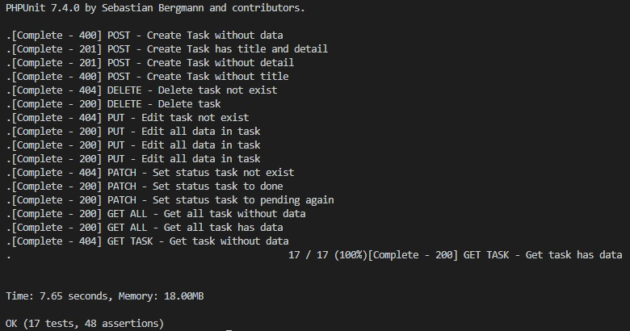

# Laravel Todo API
## Set up

1. `git clone https://github.com/nuea/laravel-todo.git`
2. `cd laravel-todo`
3. `docker-compose up`

## Document Swagger
running on - [http://localhost:8000/api/document](http://localhost:8000/api/document)
- File swagger [.json](https://github.com/nuea/laravel-todo/blob/master/swagger.json),
[.ymal](https://github.com/nuea/laravel-todo/blob/master/swagger.yaml) 

## Resource file
 - [Routes](https://github.com/nuea/laravel-todo/blob/master/routes/api.php)
 - [Controller](https://github.com/nuea/laravel-todo/blob/master/app/Http/Controllers/TaskController.php)
 - [Database Migration](https://github.com/nuea/laravel-todo/blob/master/database/migrations/2018_10_07_004514_create_todo_table.php)

## Test file
 - [View all task](https://github.com/nuea/laravel-todo/blob/master/tests/Feature/viewAllTest.php)
 - [View single task](https://github.com/nuea/laravel-todo/blob/master/tests/Feature/viewSingleTest.php) 
 - [Add a new task](https://github.com/nuea/laravel-todo/blob/master/tests/Feature/addTest.php)
 - [Edit task](https://github.com/nuea/laravel-todo/blob/master/tests/Feature/editTest.php)
 - [Set status task](https://github.com/nuea/laravel-todo/blob/master/tests/Feature/setStatusTest.php)
 - [Delete task](https://github.com/nuea/laravel-todo/blob/master/tests/Feature/deleteTest.php)
 
### How to test in Laravel (in local)
 1. install composer
 2. `cd laravel-todo`
 3. `composer install`
 4. `vendor/bin/phpunit`
 
 ### Result of test :
 

